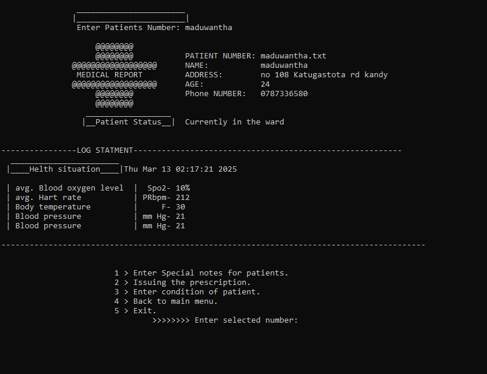
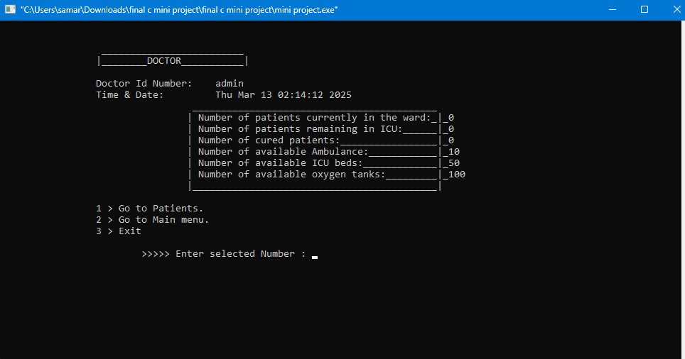
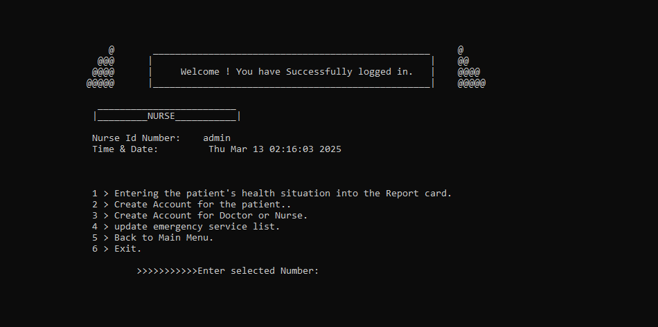

# COVID-19 Monitoring System 🏥🦠  

## Overview  
This **COVID-19 Monitoring System** is a **C-based mini project** designed to enhance communication between **patients, doctors, nurses, and emergency services**. Built using **file handling techniques**, it ensures secure access to patient data, automates resource tracking, and improves hospital efficiency during emergencies.  

## 🔑 Features  
✅ **Secure User Authentication** – Doctors and nurses can create accounts with unique **IDs and passwords** for secure access.  
✅ **Patient Profile Management** – Stores **patient details, health conditions, prescriptions, and medical notes**.  
✅ **Automated Resource Tracking** – Monitors **ICU beds, oxygen levels (O₂), and ambulance availability** using **file handling**.  
✅ **Doctor’s ICU Admission System** – Doctors can **admit patients** to the ICU and update treatment plans.  

## 📸 Screenshots  
Here are some screenshots of the system in action:  

1. **Login Page**  
     

2. **Patient Dashboard**  
     

3. **Doctor Dashboard**  
     

4. **Nurse Dashboard**  
     

## 🛠️ Technologies Used  
- **Programming Language:** C  
- **Data Storage:** File Handling  
- **Security:** ID & Password Authentication  

## 🚀 How to Run  
1. **Clone this repository:**  
   ```sh
   git clone https://github.com/yourusername/covid19-monitoring-system.git
   cd covid19-monitoring-system
